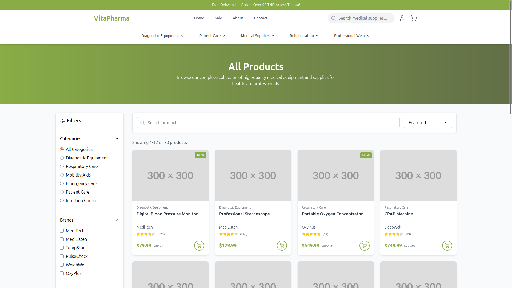
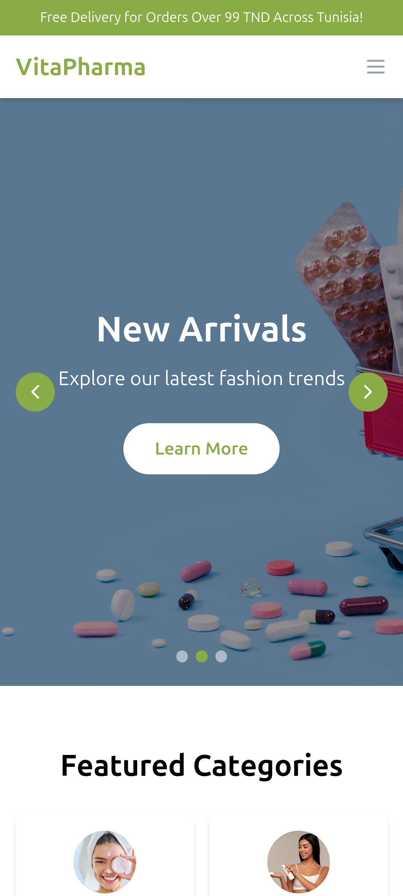

# 🌐 VitaPharma by m223rx

---

## 🚀 Features

- **Modern Landing Page**  
  Sleek and responsive design presenting VitaPharma’s mission and products.

- **Product Showcase**  
  Dedicated sections for featured supplements, with attractive visuals and descriptions.

- **About & Mission Section**  
  Highlights VitaPharma’s values, trust, and health-focused vision.

- **Contact & Call-to-Action**  
  Clear buttons and links to get in touch or learn more about products.

- **Responsive Design**  
  Fully optimized for desktop, tablet, and mobile screens.

- **Smooth Animations**  
  Transitions and hover effects that create a modern, premium feel.

---

## 🛠 Tech Stack

- **Frontend:**
  - [React.js](https://reactjs.org/) – component-based UI library
  - [Vite](https://vitejs.dev/) – fast dev server & bundler
  - [Tailwind CSS](https://tailwindcss.com/) – utility-first styling
  - [Lucide-React](https://lucide.dev/) – icons for UI sections

- **Deployment:**
  - [Netlify](https://www.netlify.com/) – hosting and continuous deployment

---

## 📸 Screenshots

### Homepage  

### Products Section  

### Mobile View  

---

## ⚡ Usage

1. **Clone the repository:**
   git clone https://github.com/m223rx/vitapharma.git
   cd vitapharma/frontend

2. **Install dependencies:**
   npm install

3. **Run the development server:**
   npm run dev

4. **Open http://localhost:5173**

## 🎨 Customization

Update TailwindCSS theme to match branding colors.
Modify components/ for sections (hero, products, about, contact).
Replace placeholder images inside assets/ with your real VitaPharma visuals.
Adjust animations for a more dynamic or minimal feel.

## 💡 Future Enhancements

Add e-commerce integration (Shopify, Stripe, or custom checkout).
Implement multi-language support (EN, FR, AR).
Add customer testimonials section.
Dark/Light mode toggle.
Newsletter signup with email integration.

## 👨‍💻 Developer
m223rx – 2025
© 2025 m223rx. All rights reserved.

---